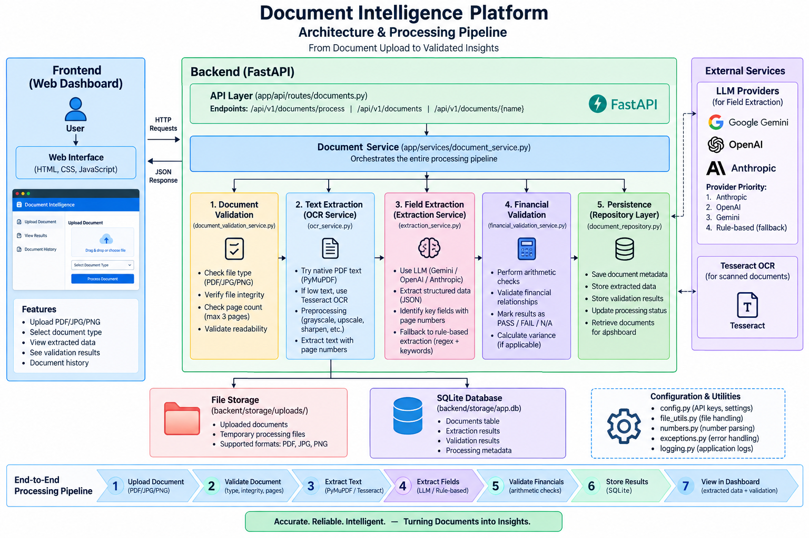
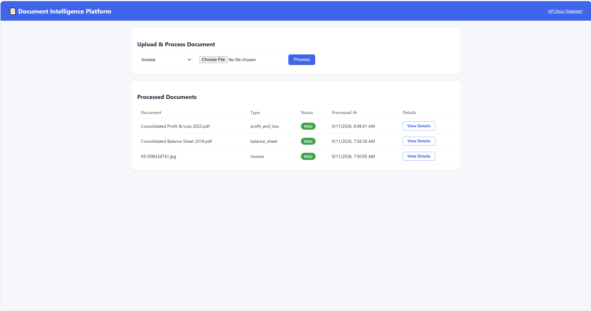
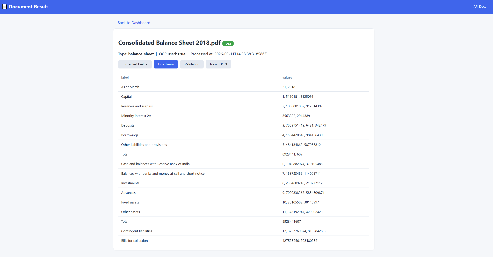
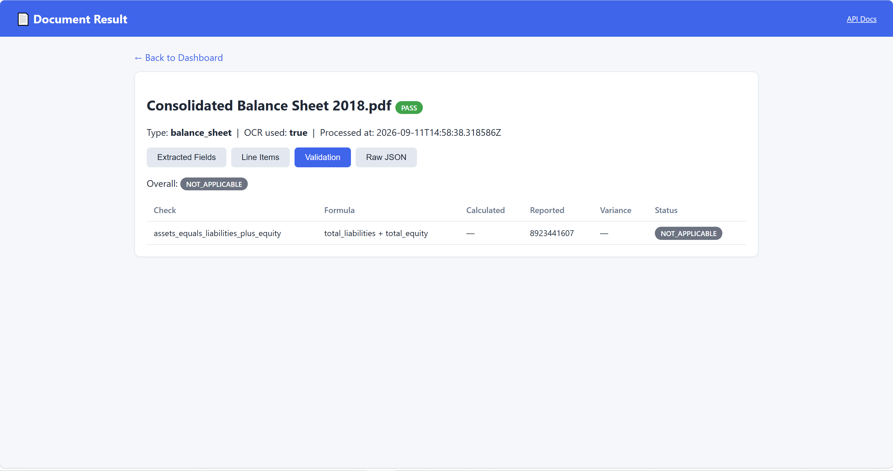
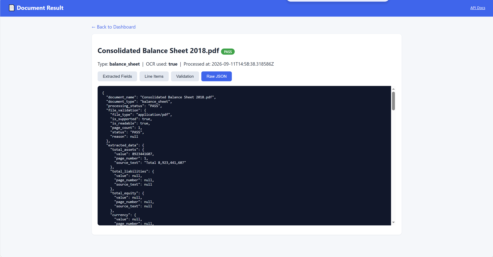
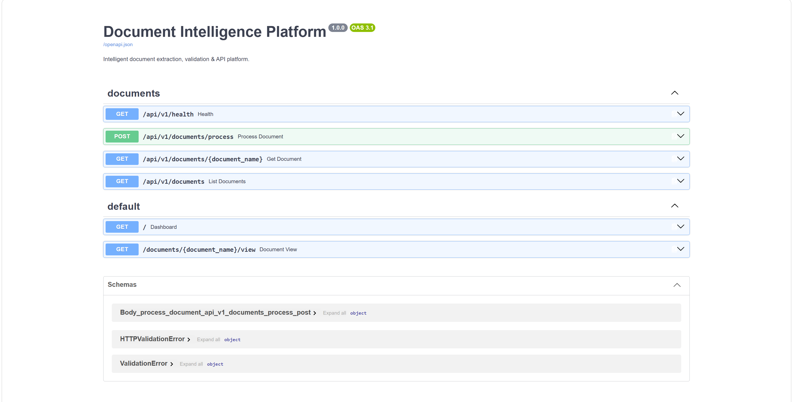

# Document Intelligence Platform

An end-to-end AI-powered document extraction & validation platform for
Invoices, Balance Sheets, Profit & Loss statements and Cash Flow
statements (PDF / JPG / PNG). Built for the AI Engineer Internship
technical case study.

>  **Before submitting:** fill in the placeholders in the
> [Live Deployment & Repository](#0-live-deployment--repository) section
> below with your actual URLs. An evaluator should be able to open this
> file and reach the working app without running any code locally.

---

## 0. Live Deployment & Repository

| Item | Link |
|---|---|
| Public GitHub Repository | https://github.com/Raka7317/company_case_study.git |
| Live Frontend / Dashboard | https://company-case-study.onrender.com |
| Live Backend API (base URL) | https://company-case-study.onrender.com/api/v1/documents |
| Swagger / OpenAPI Docs | https://company-case-study.onrender.com/docs |
| Health Check | https://company-case-study.onrender.com/api/v1/health |
| Solution Presentation (PPT) | `docs/solution_presentation.pdf` |

The backend serves the frontend itself (see Architecture below), so the
Frontend and Backend API links above will typically point to the **same
deployed service**.

---

## 1. Architecture

<p align="center">
  
</p>

See `docs/architecture.png` for the diagram. High-level flow:

```
Upload -> File Validation -> OCR/Text Extraction -> AI/Rule-based Field
Extraction -> Financial Validation -> Persist (SQLite) -> Structured JSON
-> Dashboard (HTML/CSS/JS)
```

The backend is a single FastAPI app that also serves the frontend
(Jinja2 templates + static JS calling the JSON API), so one deployed
service exposes both the dashboard and the REST API. Layers are kept
separate per the required project structure:

- `services/` — validation, OCR, extraction, financial validation, orchestration
- `repositories/` — database access
- `schemas/` — Pydantic request/response models
- `models/` — SQLAlchemy ORM models
- `api/routes/` — HTTP layer

---

## 2. Technology Stack & Why

| Concern | Choice | Reason |
|---|---|---|
| API framework | FastAPI | Async, automatic OpenAPI/Swagger docs, built-in Pydantic validation |
| Database | SQLite (SQLAlchemy ORM) | Zero-config persistence for a 3-day build; swappable for Postgres via `DATABASE_URL` with no code changes |
| PDF parsing | PyMuPDF (`fitz`) | Fast native-text extraction plus page rasterisation for OCR |
| OCR | Tesseract (`pytesseract`) | Free, local, no external API key required |
| AI extraction | Google Gemini (Flash-Lite, free tier) with a deterministic regex/keyword fallback | Works with or without an LLM key; never invents values when a field can't be found |
| Frontend | Server-rendered HTML + vanilla JS | Satisfies the "HTML/CSS, JS where required" requirement without a separate frontend stack |

---

## 3. Local Setup Instructions

```bash
cd backend
python3 -m venv .venv && source .venv/bin/activate
pip install -r requirements.txt --break-system-packages   # or drop the flag inside a venv

# System dependency (Debian/Ubuntu):
sudo apt-get install -y tesseract-ocr

cp ../.env.example .env      # edit values as needed (LLM key optional)
export $(cat .env | xargs)   # or use python-dotenv / your shell's env loader

uvicorn app.main:app --host 0.0.0.0 --port 8000 --reload
```

Open locally:
- Frontend / Dashboard: `http://localhost:8000/`
- Swagger / OpenAPI docs: `http://localhost:8000/docs`
- Health check: `http://localhost:8000/api/v1/health`

Run tests:

```bash
cd backend
PYTHONPATH=. pytest tests/ -v
```

---

## 4. Environment Variables (`.env.example`)

No real secrets are committed to the repository; `.env` is git-ignored.
Copy `.env.example` to `.env` and fill in values as needed.

| Variable | Purpose | Default |
|---|---|---|
| `DATABASE_URL` | SQLAlchemy connection string | `sqlite:///./storage/app.db` |
| `UPLOAD_DIR` | Where uploaded files are stored | `./storage/uploads` |
| `MAX_PAGES` | Max allowed pages per document | `3` |
| `OCR_MIN_NATIVE_CHARS` | Threshold to decide a PDF page needs OCR | `40` |
| `TESSERACT_CMD` | Path to the tesseract binary | `tesseract` |
| `ANTHROPIC_API_KEY` | Optional — enables Claude-based extraction | *(empty = next provider / rule-based fallback)* |
| `ANTHROPIC_MODEL` | Model name if using Anthropic | `claude-sonnet-4-6` |
| `OPENAI_API_KEY` | Optional — enables OpenAI-based extraction | *(empty)* |
| `OPENAI_MODEL` | Model name if using OpenAI | `gpt-4o-mini` |
| `GOOGLE_API_KEY` | Optional — enables Gemini-based extraction (genuine free tier, no card required) | *(empty)* |
| `GEMINI_MODEL` | Model name if using Gemini | `gemini-2.5-flash-lite` |
| `VALIDATION_TOLERANCE` | Absolute currency tolerance for PASS/FAIL | `1.0` |
| `VALIDATION_TOLERANCE_PCT` | Relative tolerance (% of reported value) | `0.01` |
| `LOG_LEVEL` | Logging verbosity | `INFO` |

Provider priority if more than one key is set: **Anthropic → OpenAI →
Google Gemini → rule-based fallback** (no key at all still produces a
result end-to-end, just with lower accuracy).

---

## 5. API Reference

Full interactive documentation is available at `/docs` (Swagger UI) on
the deployed environment — see [Section 0](#0-live-deployment--repository).

### `POST /api/v1/documents/process`

```bash
curl -X POST https://<host>/api/v1/documents/process \
  -F "file=@sample_invoice.pdf" \
  -F "document_type=invoice"
```

`document_type` is one of: `invoice`, `balance_sheet`,
`profit_and_loss`, `cash_flow_statement`.

### `GET /api/v1/documents/{document_name}`

```bash
curl https://<host>/api/v1/documents/sample_invoice.pdf
```

Returns the **latest** structured result stored for that document name.

### `GET /api/v1/documents`

```bash
curl https://<host>/api/v1/documents
```

Returns the list of processed documents (name, type, status, timestamp)
used to populate the dashboard.

### `GET /api/v1/health`

```bash
curl https://<host>/api/v1/health
```

### Error response shape

```json
{"error": {"code": "UNSUPPORTED_FILE_TYPE", "message": "Only PDF / JPG / PNG documents are supported."}}
```

---

## 6. OCR / Extraction Approach

1. **Native PDFs** — text is pulled directly via PyMuPDF, per page.
2. **Scanned pages / images** — the page is rasterised (250 DPI) and run
   through **Tesseract OCR** (free, local, no external API/key needed).
3. **Field extraction**:
   - If an LLM key is configured (Anthropic, then OpenAI, then Gemini,
     in that priority order), the OCR/parsed text — with page markers —
     is sent to the model with a strict "JSON only, null if absent,
     never invent values" instruction, tailored per document type.
   - If no key is set, or the LLM call fails for any reason, a
     **deterministic rule-based extractor** (regex + keyword matching
     with synonym lists, e.g. "total assets" / "total capital and
     liabilities") runs instead, so the pipeline always produces a
     result end-to-end without a paid dependency.
   - `processing_metadata.extraction_method` in every response tells
     you which path was actually used (`llm` or `rule_based`).

Confidence scoring is **not implemented** (explicitly optional per the
brief); `page_number` + `source_text` evidence is populated for every
extracted value instead, so results stay traceable to the source
document.

---

## 7. Financial Validation Rules & Tolerance

Implemented in `app/services/financial_validation_service.py`. Every
check passes if it is within an **absolute tolerance** of
`VALIDATION_TOLERANCE` currency units **or** a **relative tolerance**
of `VALIDATION_TOLERANCE_PCT` (1% by default) — whichever is larger —
to absorb rounding differences in the source document.

- **Invoice**: `subtotal + tax_amount − discount ≈ total_amount`; per
  line item `quantity × unit_price ≈ amount`; sum of line items
  reconciled to subtotal/total where applicable.
- **Balance Sheet**: `total_liabilities + total_equity ≈ total_assets`,
  validated independently for each year/period present.
- **Profit & Loss**: `revenue − cost_of_sales ≈ gross_profit`;
  `gross_profit − operating_expenses ≈ operating_profit`;
  `operating_profit − tax ≈ net_profit`; validated per comparative
  period present.
- **Cash Flow**: `operating + investing + financing ≈ net_change_in_cash`;
  `opening_cash + net_change_in_cash ≈ closing_cash`. Bracketed /
  parenthesised values are parsed as negative numbers.

Whenever a field required for a given check is missing from the source
document, that check returns `NOT_APPLICABLE` rather than assuming or
inventing a value — see `sample_outputs/balance_sheet__*.json` for a
real example against a bank-format statement.

---

## 8. Database / Persistence

SQLite via SQLAlchemy (table `processed_documents`: `document_name`,
`document_type`, `processing_status`, `result_json`, `created_at`).

- Retrieval by name always returns the most recent row
  (`ORDER BY created_at DESC LIMIT 1`).
- Older versions of a re-processed document are retained, not deleted
  (the brief marks retaining prior versions as optional; this
  implementation keeps them for free).
- Swapping to Postgres/MySQL only requires changing `DATABASE_URL` —
  no code changes needed.

---

## 9. Frontend

- `/` — Dashboard: document-type selector, PDF/JPG/PNG upload control,
  "Process" action, and a table of all processed documents
  (name / type / status / processed time) linking into each result.
- `/documents/{name}/view` — Result page with tabs for extracted
  key-value fields (missing fields highlighted), the line-items table,
  financial validation checks (PASS / FAIL / NOT_APPLICABLE badges),
  and a raw JSON viewer for the full structured response.

---

## Screenshots

### Dashboard

<p align="center">
  
</p>

### Extracted Fields

<p align="center">
  
</p>

### Line Items

<p align="center">
  
</p>

### Financial Validation

<p align="center">
  
</p>

### Raw JSON

<p align="center">
  
</p>

### Swagger / OpenAPI

<p align="center">
  
</p>

---

## 10. Testing

`backend/tests/`:
- `test_validation.py` — file validation (unsupported type, empty file, valid image).
- `test_extraction.py` — number parsing (parentheses-as-negative, currency symbols) and financial validation logic (PASS / FAIL / NOT_APPLICABLE).
- `test_api.py` — health check, list endpoint, unsupported-file rejection (415), and a full process → retrieve flow.

`sample_outputs/` contains real JSON outputs generated by running this
exact code against files from the provided dataset, covering: an
invoice (scanned image, OCR path), a balance sheet, a P&L statement, a
cash flow statement, plus an unsupported-file-type and an
empty/corrupted-file edge case.

---

## 11. Deployment Notes

Any container-friendly free-tier host works (Render / Railway / Koyeb).
Example for Render (Web Service):

- **Build command:** `pip install -r backend/requirements.txt`
- **Start command:** `uvicorn app.main:app --app-dir backend --host 0.0.0.0 --port $PORT`
- Install `tesseract-ocr` on the image — Render's native Python runtime
  does not include it by default, so a Dockerfile is the most reliable
  path (see below).
- Set environment variables from `.env.example` in the platform
  dashboard (an LLM key is optional — the app falls back to the free
  rule-based extractor if none is set).
- Health check path: `/api/v1/health`.

Minimal Dockerfile (add at the repo root if your platform prefers
container deploys):

```dockerfile
FROM python:3.12-slim
RUN apt-get update && apt-get install -y tesseract-ocr && rm -rf /var/lib/apt/lists/*
WORKDIR /app
COPY backend/requirements.txt .
RUN pip install --no-cache-dir -r requirements.txt
COPY backend ./backend
COPY frontend ./frontend
ENV PYTHONPATH=/app/backend
CMD ["uvicorn", "app.main:app", "--app-dir", "backend", "--host", "0.0.0.0", "--port", "8000"]
```

---

## 12. AI / Tool Usage Declaration

This solution (backend architecture, all service/route/schema code,
the frontend, tests, and this README) was developed with the
assistance of AI coding assistants (Claude and, for OCR/LLM extraction
prompt design, general LLM guidance), based on the case-study
requirements document. All generated code was reviewed and is
understood by the candidate, who is prepared to explain, debug, and
modify any part of the codebase during the interview discussion.

---

## 13. Known Limitations

- The rule-based fallback extractor uses keyword/regex matching; it
  will miss fields when a real-world document uses unconventional
  labels (e.g. certain bank-format balance sheets label both sections
  simply "Total" — see `sample_outputs/balance_sheet__*.json`, where
  `total_liabilities` / `total_equity` correctly resolve to
  `NOT_APPLICABLE` rather than being guessed).
- Confidence scoring is not implemented (explicitly optional per the brief).
- OCR accuracy depends on scan quality; no image pre-processing
  (deskew/denoise) beyond straightforward rasterisation is applied.
- Multi-currency / multi-column comparative-period parsing captures the
  primary (first/most recent) column for named fields; the full
  comparative table is still available via `extracted_data.line_items`.
- Synchronous processing only, per the assignment's allowed scope.

---

## 14. What Would Change for a Production Deployment

- Swap/strengthen the rule-based fallback with a properly evaluated
  LLM-extraction pipeline, add per-field confidence scoring, and a
  human-in-the-loop review queue for low-confidence values.
- Move file storage to S3/Blob storage instead of local disk.
- Move to Postgres, add Alembic migrations, and add
  background/async processing (queue + worker) for larger documents.
- Add authentication/authorization on the API and audit trails.
- Add structured, correlation-ID based logging shipped to a central
  log store, plus metrics and alerting.
- Expand automated test coverage (property-based tests for extraction
  regexes, golden-file regression tests per document type).
